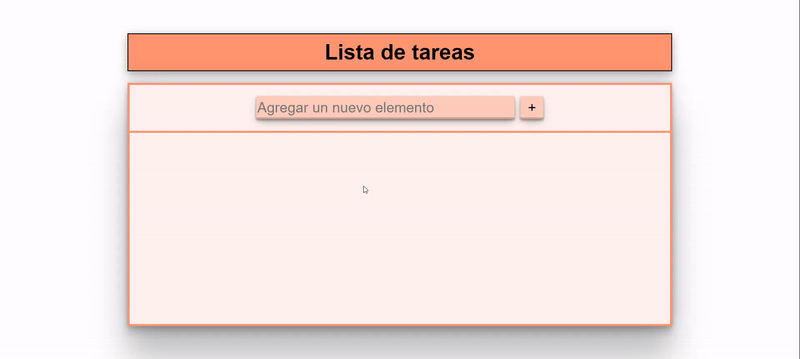

<h1 align='center'>🌟 Página ToDoList ✅🌟</h1>

> Practica de HTML, CSS, JavaScript y React. ✨

🎯 Objetivo: Crear una página ToDoList.

Esta idea de proyecto está inspirada en el curso "JavaScript para Manipulación del DOM" de FreeCodeCamp Español. Aunque me guié por la idea presentada en el curso, he desarrollado esta página ToDoList a mi manera, añadiendo mis propios enfoques y personalizaciones. Puedes encontrar el curso en este enlace [aquí](https://www.youtube.com/watch?v=koiPxFFiqJ4 "Click aquí").

------------

### Instalación y ejecución 🛠️💻

Sigue estos pasos para clonar y ejecutar el proyecto localmente:

1. Abre la consola en la ubicación deseada para clonar el repositorio.

2. Para clonar este repositorio en tu máquina local utilizando Git, ejecuta el siguiente comando:

    ```bash
    git clone https://github.com/Schugu/ToDoList.git
    ```

3. Navega al directorio del proyecto clonado:

    ```bash
    cd ToDoList
    ```

4. Instala las dependencias del proyecto utilizando npm o yarn:

    ```bash
    npm install
    # o
    yarn
    ```

5. Inicia el servidor de desarrollo utilizando Vite:

    ```bash
    npm run dev
    # o
    yarn dev
    ```

6. Una vez que el servidor de desarrollo esté en funcionamiento, abre tu navegador web y navega a la IP que se muestra en la consola para ver el proyecto en acción.

### Personalización y comprensión del proyecto 🎨🧠

7. Si deseas personalizar los estilos de la página, puedes hacerlo modificando los archivos CSS ubicados en la carpeta src. Todos los estilos de la aplicación se encuentran en los archivos App.css e index.css. Abre el archivo CSS correspondiente en tu editor de texto o IDE preferido, realiza los cambios que desees y guarda el archivo. Luego, asegúrate de que los estilos se apliquen correctamente importando el archivo CSS adecuado en el archivo JSX correspondiente.

8. Si deseas modificar o entender cómo funciona un componente específico, te recomiendo revisar los archivos JSX correspondientes ubicados en la carpeta src. La lógica de la aplicación se encuentra principalmente en los archivos App.jsx y Main.jsx. Analiza el código en estos archivos JSX para entender su funcionamiento o realizar modificaciones según sea necesario.

------------

### Capturas de pantalla 📸



