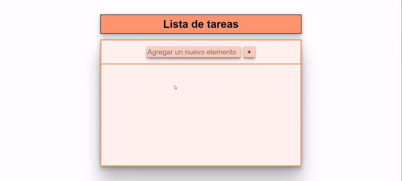

<h1 align='center'>🌟 Página ToDoList ✅🌟</h1>

> Practica de HTML, CSS y JavaScript. ✨

🎯 Objetivo: Crear una página ToDoList.

Esta idea de proyecto está inspirada en el curso "JavaScript para Manipulación del DOM" de FreeCodeCamp Español. Aunque me guié por la idea presentada en el curso, he desarrollado esta página generadora de colores hexadecimales aleatorios a mi manera, añadiendo mis propios enfoques y personalizaciones. Puedes encontrar el curso en este enlace [aquí](https://www.youtube.com/watch?v=koiPxFFiqJ4 "Click aquí").

------------

### Instalación 🛠️💻

Sigue estos pasos para clonar y ejecutar el proyecto localmente:

1. Clona este repositorio en tu máquina local utilizando Git:

    ```bash
    git clone https://github.com/Schugu/ToDoList.git
    ```

2. Navega al directorio del proyecto:

    ```bash 
    cd ToDoList
    ```

3. Una vez clonado el repositorio en tu máquina local, abre el archivo `index.html` en tu navegador web para ver el proyecto.

4. Si deseas personalizar los estilos de la página, puedes hacerlo modificando el archivo `styles.css`. Este archivo contiene todas las reglas de estilo que se aplican a la página. Abre el archivo `styles.css` en un editor de texto o IDE de tu elección, realiza los cambios que desees y guarda el archivo. Luego, recarga la página en tu navegador para ver los cambios aplicados.

5. Si deseas modificar o entender cómo funciona la página, te recomendamos revisar el archivo `app.js`. Este archivo contiene el código JavaScript que hace funcionar el ToDoList.

------------

### Capturas de pantalla 📸



